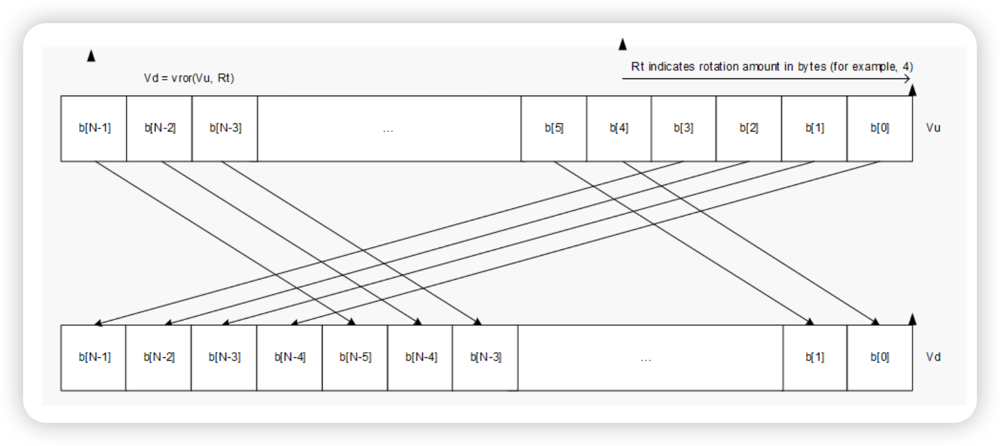

# Lab4: Hexagon NPU GEMM

## 目录

- [环境准备](#环境准备)
  - [Hexagon SDK 安装](#hexagon-sdk-安装)
  - [Android NDK 安装](#android-ndk-安装)
- [代码编译与运行](#代码编译与运行)
  - [编译 NPU 代码](#编译-npu-代码)
  - [实体设备运行 (推荐)](#实体设备运行-推荐)
  - [模拟器运行 (备选)](#模拟器运行-备选)

---

## 环境准备

### Hexagon SDK 安装

本项目需要 Hexagon SDK。可以通过两种方式获取：推荐使用 QPM（需 Qualcomm 账户和许可），或直接手动下载解压（无需 QPM 但需手动配置）。下面先说明两种方法，然后统一说明环境变量和权限。

A. 推荐：使用 QPM 安装（需 Qualcomm 账号与许可）

1. 下载并安装 QPM

```bash
# 安装系统依赖并安装 qpm 客户端包（将 <your-qpm-package>.deb 替换为实际文件名）
sudo apt update && sudo apt install -y bc xdg-utils
sudo dpkg -i <your-qpm-package>.deb
```

2. 登录、激活许可证并安装 Hexagon SDK

```bash
qpm-cli --login <username>/<email>
# 激活许可证并安装指定版本（示例：HexagonSDK6.x）
qpm-cli --license-activate HexagonSDK6.x
sudo qpm-cli --install HexagonSDK6.x
```

3. 找到 QPM 安装位置（QPM 的默认安装路径可能因环境而异）。如果不确定安装目录，可以用下面命令搜索已安装的 Hexagon SDK 目录（通常在/local/mnt/workspace/Qualcomm/Hexagon_SDK/6.3.0.0）：

```bash
# 在常见位置查找（可能需要 sudo）
sudo find / -maxdepth 4 -type d -name 'Hexagon_SDK*' 2>/dev/null | head -n 20
```

B. 备选：手动下载并解压（无需 QPM）

如果无法使用 QPM，可直接下载官方 SDK 压缩包并解压到你选择的目录：

```bash
wget https://apigwx-aws.qualcomm.com/qsc/public/v1/api/download/software/sdks/Hexagon_SDK/Linux/Debian/6.3.0.0/Hexagon_SDK.zip
unzip Hexagon_SDK.zip -d /workspace/Qualcomm/Hexagon_SDK/6.3.0.0
```

（这里示例使用 `/workspace/Qualcomm/Hexagon_SDK/6.3.0.0`，你可以根据自己的工作区调整路径。）

C. 统一的环境变量

需要在 `~/.bashrc` 中设置 Hexagon SDK 目录的环境变量：

```bash
# 将下面的路径替换为实际的 Hexagon SDK 安装目录
export HEXAGON_SDK_PATH=/path/to/Qualcomm/Hexagon_SDK/6.3.0.0
```

保存后运行 `source ~/.bashrc` 或重开一个终端使配置生效。

- 在编译 Hexagon NPU 代码前需要执行`source $HEXAGON_SDK_PATH/setup_sdk_env.source`

D. Codespaces / 权限 注意事项

如果你在 Codespaces 或受限环境中运行，可能需要调整 SDK 内部工具的权限：

```bash
sudo chown -R $(whoami):$(whoami) /path/to/Qualcomm/Hexagon_SDK/6.3.0.0/utils
```

将上面的 `$(whoami)` 替换为你的用户（例如 `codespace`），并将路径替换为实际安装目录。

E. 小结

- 如果使用 QPM，安装后请通过查找命令确认 SDK 安装目录并设置环境变量；
- 如果手动解压，按你选定的目录设置环境变量；
- 编辑 `~/.bashrc` 后记得 `source ~/.bashrc`。

### Android NDK 安装

#### 1. 下载并配置 Android SDK Command Line Tools

1. **下载 Command Line Tools**
   
   ```bash
   wget https://googledownloads.cn/android/repository/commandlinetools-linux-13114758_latest.zip
   ```

2. **解压并组织目录结构**
   
   ```bash
   unzip commandlinetools-linux-13114758_latest.zip
   mkdir -p ~/Android/Sdk/cmdline-tools/latest
   mv cmdline-tools/* ~/Android/Sdk/cmdline-tools/latest/
   ```

3. **配置环境变量**
   
   在 `~/.bashrc` 中添加：
   
   ```bash
   export PATH=~/Android/Sdk/cmdline-tools/latest/bin/:$PATH
   ```
   
   使配置生效：
   
   ```bash
   source ~/.bashrc
   ```

#### 2. 安装 NDK

1. **查看可用版本并安装**
   
   ```bash
   sdkmanager --list
   sdkmanager "ndk;29.0.13113456"
   ```

2. **配置 NDK 环境变量**
   
   在 `~/.bashrc` 中添加：
   
   ```bash
   export ANDROID_NDK_ROOT=~/Android/Sdk/ndk/29.0.13113456/
   ```

3. **安装 ADB 工具**
   
   ```bash
   sudo apt install android-tools-adb
   ```

---

## 代码编译与运行

### 编译 NPU 代码

**执行下列命令前，确保自己处于`/OS-2026/Lab4`目录**

首先设置 Hexagon SDK 环境并编译 DSP 代码：

```bash
source $HEXAGON_SDK_PATH/setup_sdk_env.source
cd dsp
make hexagon BUILD=Debug DSP_ARCH=v79
```

### 实体设备运行 (推荐)

#### 1. 申请 QDC 设备

1. 在 [高通 QDC 平台](https://qdc.qualcomm.com) 申请一台骁龙 8 Elite 手机
2. 选择 SSH 连接方式
3. 创建私钥并保存到 `~/qdc.pem`，修改权限：
   
   ```bash
   chmod 600 ~/qdc.pem
   ```

#### 2. 建立设备连接

1. **创建 SSH 隧道**
   
   点击 QDC 页面右上角的【Connect】按钮，复制连接命令，例如：
   
   ```bash
   ssh -i ~/qdc.pem -L 5037:sa324277.sa.svc.cluster.local:5037 -N sshtunnel@ssh.qdc.qualcomm.com
   ```

2. **验证设备连接**
   
   ```bash
   adb devices
   ```
   
   应该能看到已连接的设备。

#### 3. 编译 Android 测试工具

**执行下列命令前，确保自己处于`/OS-2026/Lab4`目录**

```bash
source $HEXAGON_SDK_PATH/setup_sdk_env.source
mkdir build
cd build
cmake -DANDROID_ABI=arm64-v8a -DANDROID_PLATFORM=android-24 \
   -DCMAKE_TOOLCHAIN_FILE=$ANDROID_NDK_ROOT/build/cmake/android.toolchain.cmake \
   -DHEXAGON_SDK_ROOT=$HEXAGON_SDK_ROOT ..
make
```

#### 4. 部署并运行测试

**执行下列命令前，确保自己处于`/OS-2026/Lab4/build`目录**

1. **推送文件到设备**
   
   ```bash
   adb push npu_gemm_test /data/local/tmp/
   adb push ../dsp/hexagon_Debug_toolv88_v79/ship/libcalculator_skel.so /data/local/tmp/
   ```

2. **在设备上执行测试**
   
   ```bash
   adb shell
   cd /data/local/tmp
   chmod +x npu_gemm_test
   ./npu_gemm_test 64 64 64 --cpu-check
   ```

### 模拟器运行 (备选)

> ⚠️ **注意**：模拟器运行性能较差，且不方便进行功能验证。

#### 1. 修改必要的依赖库

```bash
sudo ln -s /usr/lib/x86_64-linux-gnu/libncurses.so.6 \
           /usr/lib/x86_64-linux-gnu/libncurses.so.5
```

#### 2. 运行 Hexagon 模拟器

**执行下列命令前，确保自己处于`/OS-2026/Lab4/dsp`目录且 NPU 代码编译成功**

```bash
export DSP_BUILD_DIR=hexagon_Debug_toolv88_v79

${HEXAGON_SDK_ROOT}/tools/HEXAGON_Tools/8.8.06/Tools/bin/hexagon-sim \
    -mv79 \
    --simulated_returnval \
    --usefs ${DSP_BUILD_DIR} \
    --pmu_statsfile ${DSP_BUILD_DIR}/pmu_stats.txt \
    --cosim_file ${DSP_BUILD_DIR}/q6ss.cfg \
    --l2tcm_base 0xd800 \
    --rtos ${DSP_BUILD_DIR}/osam.cfg \
    ${HEXAGON_SDK_ROOT}/rtos/qurt/computev79/sdksim_bin/runelf.pbn \
    -- \
    ${HEXAGON_SDK_ROOT}/libs/run_main_on_hexagon/ship/hexagon_toolv88_v79/run_main_on_hexagon_sim \
    stack_size=0x400000 \
    -- \
    libtest_calculator_sim.so 64 64 64
```

---

## 常见问题

- **相对地址**：教程中的shell命令有许多相对地址，请确保当前终端所处目录是否正确
- **权限问题**：确保 Codespaces 用户对 Hexagon SDK 目录有适当的读写权限
- **环境变量**：每次新开终端时需要重新 source Hexagon 环境变量
- **设备连接**：如果 ADB 无法识别设备，检查 SSH 隧道是否正常建立
- **编译错误**：确保所有必要的环境变量都已正确设置
- **libinfo.so.5报错**：如果遇到缺少libinfo5的报错，执行`sudo apt install libtinfo5`
或者执行`ln -s /usr/lib/x86_64-linux-gnu/libtinfo.so.6 /usr/lib/x86_64-linux-gnu/libtinfo.so.5`

## 使用 Hexagon 指令集优化矩阵乘法

### HVX 指令参考手册

HVX（Hexagon Vector eXtensions）是高通Hexagon DSP的向量扩展指令集，专门用于加速并行计算。以下是矩阵乘法优化中最常用的核心指令及其作用原理。

#### 基本概念：向量化处理

**HVX向量宽度**
```
一个 HVX_Vector = 32个float（128字节，1024位）

标量处理:  [a] × [b] = [c]           (一次处理1个元素)
向量处理:  [a₁ a₂ ... a₃₂] × [b₁ b₂ ... b₃₂] = [c₁ c₂ ... c₃₂]  (一次处理32个元素)
```

#### 核心HVX指令功能说明

**1. 标量广播指令 - `Q6_V_vsplat_R()`**

**作用**: 将一个标量值复制到向量的所有32个位置

```
输入标量: 3.14
      ↓ vsplat
输出向量: [3.14, 3.14, 3.14, ..., 3.14]  (32个相同值)
```

**应用场景**: 在矩阵乘法中，将矩阵A的一个元素与矩阵B的一行进行向量乘法

**示例**: `HVX_Vector vector1 = Q6_V_vsplat_R(float_to_bits(3.14f));`


**2. 零向量创建 - `Q6_V_vzero()`**

**作用**: 创建所有元素都为0的向量，用作累加器初始化

```
输出: [0.0, 0.0, 0.0, ..., 0.0]  (32个零)
```

**示例**: `HVX_Vector vZero = Q6_V_vzero();`


**3. 向量乘法指令 - `Q6_Vqf32_vmpy_VsfVsf()`**

**作用**: 对两个向量进行逐元素相乘（SIMD乘法）

```
向量A: [a₁, a₂, a₃, ..., a₃₂]
向量B: [b₁, b₂, b₃, ..., b₃₂]
      ↓ 向量乘法
结果:  [a₁×b₁, a₂×b₂, a₃×b₃, ..., a₃₂×b₃₂]
```

**加速效果**: 一条指令完成32次浮点乘法运算

**示例**: `HVX_Vector mul = Q6_Vqf32_vmpy_VsfVsf(vector1, vector2);`


**4. 向量加法指令 - `Q6_Vqf32_vadd_Vqf32Vqf32()`**

**作用**: 对两个向量进行逐元素相加（SIMD加法）

```
向量A: [a₁, a₂, a₃, ..., a₃₂]
向量B: [b₁, b₂, b₃, ..., b₃₂]
      ↓ 向量加法
结果:  [a₁+b₁, a₂+b₂, a₃+b₃, ..., a₃₂+b₃₂]
```

**示例**: `HVX_Vector sum = Q6_Vqf32_vadd_Vqf32Vqf32(vector1, vector2);`


**5. 向量旋转指令 - `Q6_V_vror_VR()`**

**作用**: 将向量中的元素循环右移，用于向量归约（reduction），此示例中，位移距离为4
值得注意的是，虽然名称叫右移，实际上是将数据向数组下标减少的方向移动。

手册中的描述是：
```
Perform a right rotate vector operation on vector register Vu, by the number of bytes specified by
the lower bits of Rt. The result is written into Vd. Byte[i] moves to Byte[(i+N-R)%N], where R is the
right rotate amount in bytes, and N is the vector register size in bytes.
```



```
原向量: [a₁, a₂, a₃, a₄, a₅, a₆, a₇, a₈]
右移4位: [a₅, a₆, a₇, a₈, a₁, a₂, a₃, a₄]
```

**归约过程示意** (以8元素为例):
```
步骤1: [a₁, a₂, a₃, a₄, a₅, a₆, a₇, a₈] + 右移4位 → [a₁+a₅, a₂+a₆, a₃+a₇, a₄+a₈, *, *, *, *]
步骤2: 上述结果 + 右移2位 → [a₁+a₅+a₃+a₇, a₂+a₆+a₄+a₈, *, *, *, *, *, *]  
步骤3: 上述结果 + 右移1位 → [总和, *, *, *, *, *, *, *]
```

**示例**: `HVX_Vector vector = Q6_V_vror_VR(vector_original, 16 * sizeof(float))`


**6. 数据格式转换 - `Q6_Vsf_equals_Vqf32()`**

**作用**: 将QF32格式转换为SF格式并进行饱和处理，需要参考 Hexagon 手册，注意一些函数的入参是 qf32 还是 sf，如果参数不对需要进行转换

```
QF32格式 (高精度中间格式) → SF格式 (标准浮点格式)
用于防止计算溢出，确保结果精度
```

**示例**: `HVX_Vector vector_sf = Q6_Vsf_equals_Vqf32(vector_qf32);`

#### 关键优化概念

**1. 内存对齐要求**
- HVX向量要求128字节对齐
- 非对齐访问需使用`memcpy()`避免性能损失（将非对齐的内存，memcopy 到数据类型为 HVX_Vector 的变量）

**2. 边界处理策略**
- 主循环: 处理能被32整除的部分（向量化）
- 尾部循环: 处理剩余元素（标量化）

**3. 数据格式说明**
- **SF**: 标准IEEE 754单精度浮点格式
- **QF32**: 高精度定点格式，用于中间计算防止溢出

#### 实际应用示例

**矩阵乘法的两种HVX优化模式**

**模式1: ikj循环顺序（外积形式）**
```
优势: 可以充分利用向量广播
过程: A[i][k] × B[k][j:j+31] → C[i][j:j+31]
      ↑ 广播1个值    ↑ 加载32个值    ↑ 更新32个值
```

**模式2: ijk循环顺序（内积形式）**  
```
优势: 更好的缓存局部性，适合转置矩阵
过程: A[i][k:k+31] · B[j][k:k+31] → C[i][j] (点积)
      ↑ 加载32个值   ↑ 加载32个值      ↑ 归约为1个值
```

#### 性能提升原理

**计算密度提升**
```
标量版本: 1条指令 = 1次浮点运算
HVX版本:  1条指令 = 32次浮点运算
理论加速: 32倍
```

**内存带宽优化**
```
标量版本: 每次访问4字节 (1个float)
HVX版本:  每次访问128字节 (32个float)
内存效率: 提升32倍
```